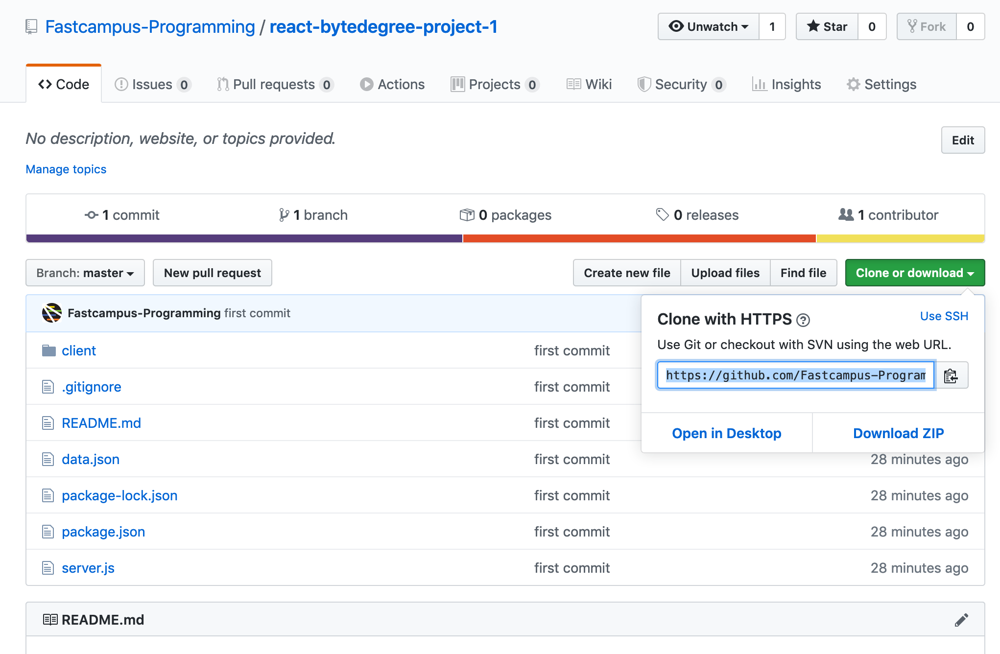
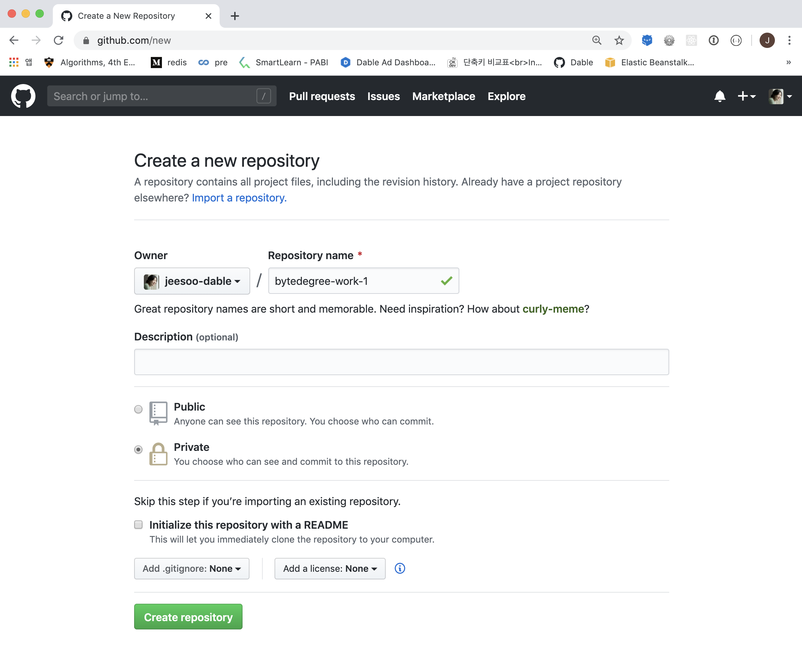
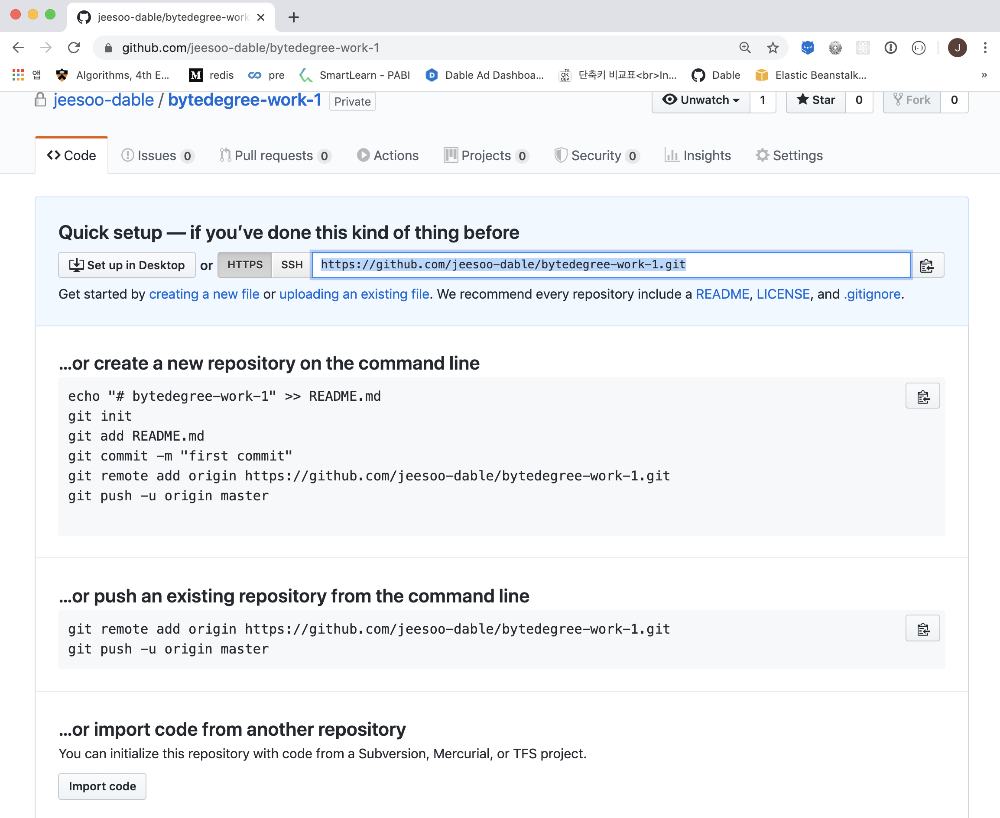
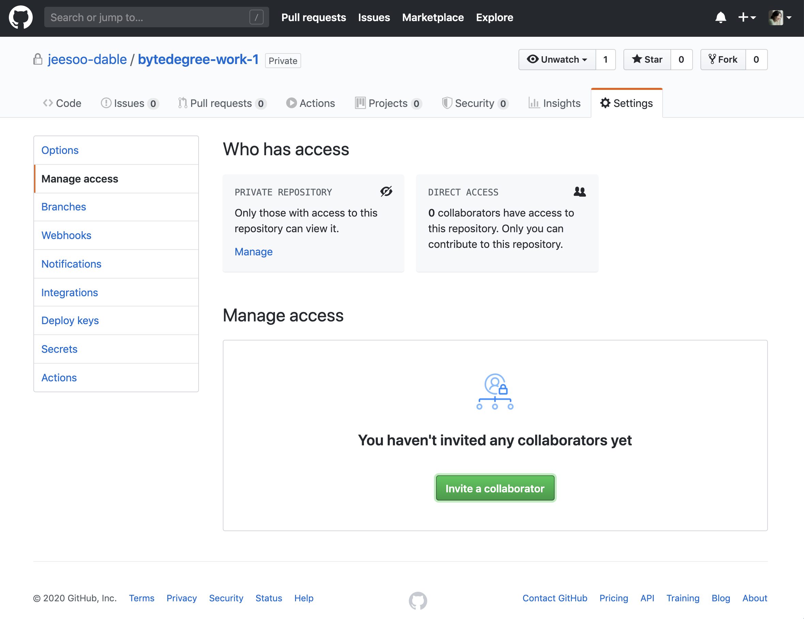
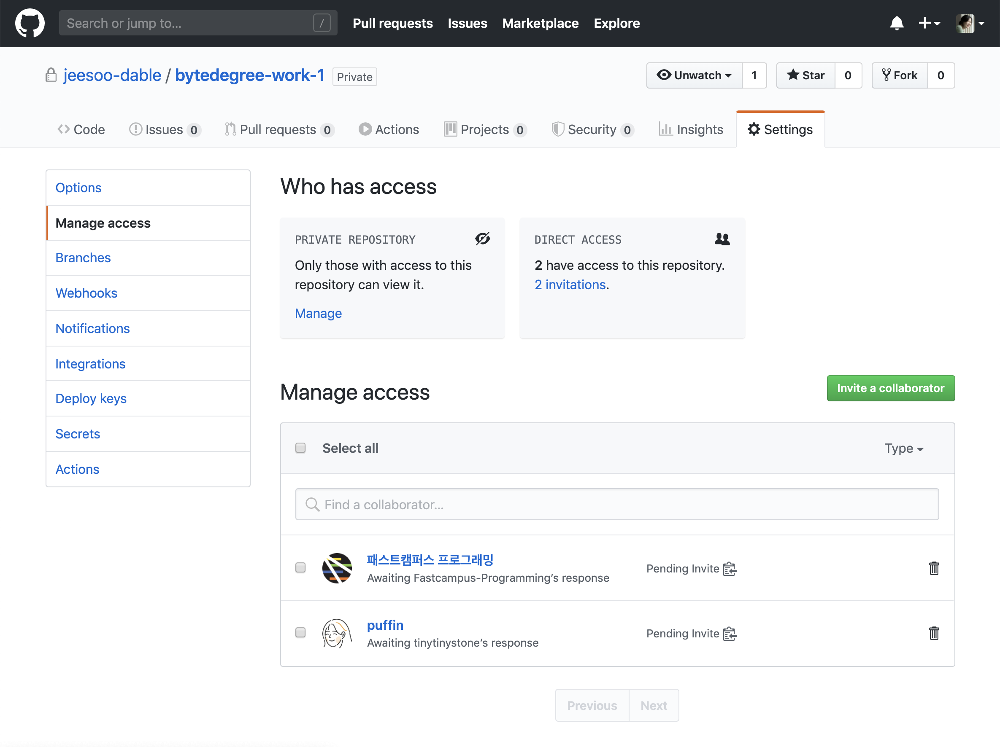
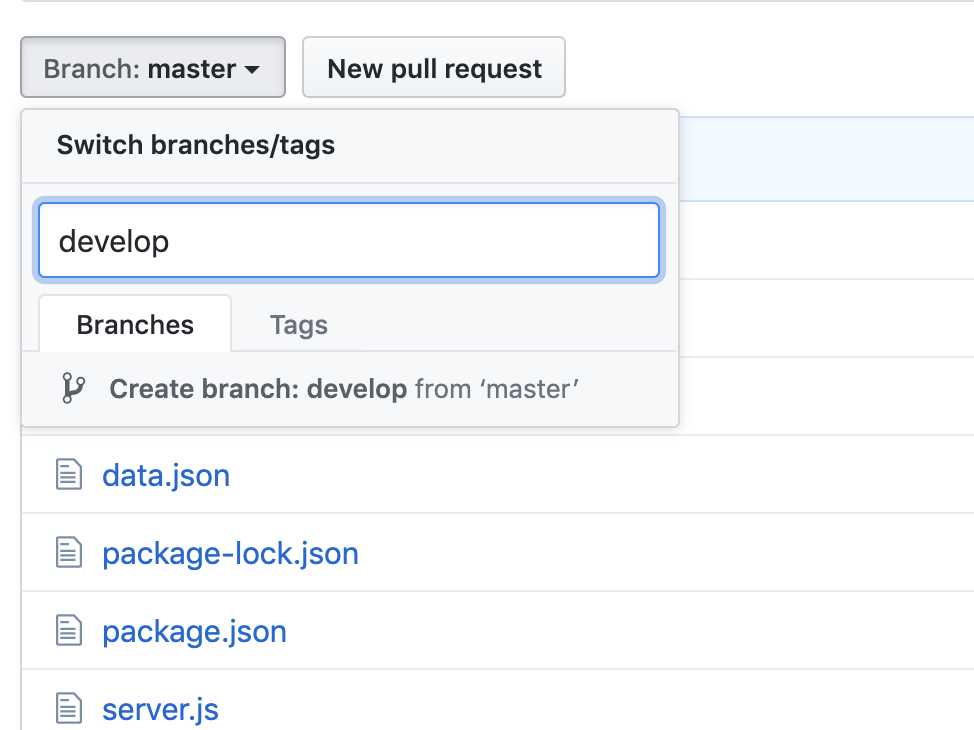
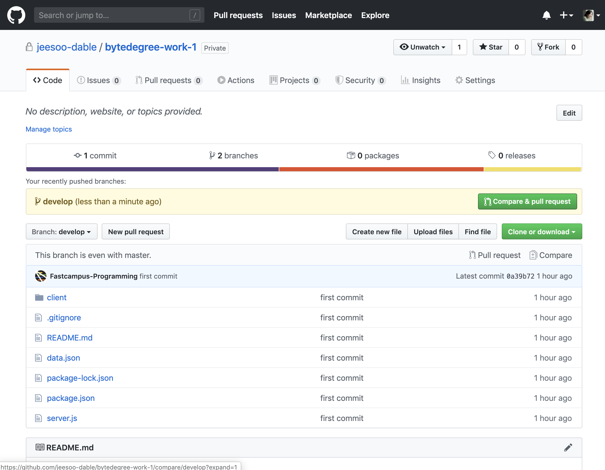
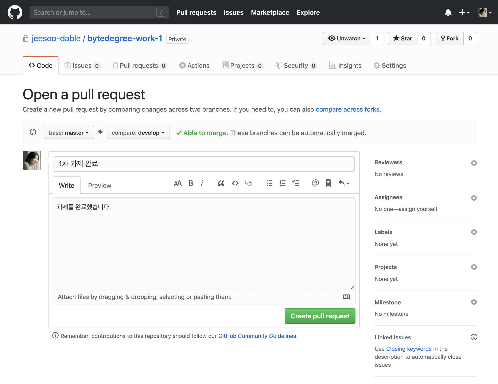

# 과제 제출 가이드

아래와 같은 방식으로 과제를 제출하여 리뷰를 받으실 수 있습니다.

1. 자신의 컴퓨터에 과제 repository를 bare 옵션으로 clone 합니다.
(초록색 Clone or download 버튼을 클릭하신 후 나타나는 링크를 그대로 복사하셔서 사용하시면 됩니다)



```
$ git clone --bare https://github.com/Fastcampus-Programming/react-bytedegree-project-1.git
```

2. 자신의 github에 과제를 업로드할 repository를 새롭게 생성합니다. 이때, 공개여부를 Private으로 설정합니다.
(Repository name을 예시와 동일하게 bytedegree-work-1 으로 생성하시는 경우 앞으로 아래 {과제-레포} 부분에는 bytedegree-work-1을 입력하시면 됩니다. 다른 이름으로 생성하시는 경우에는 {과제-레포} 부분에 본인이 생성한 Repository name을 입력해주세요)  



3. 다시 terminal로 돌아와, 해당 git 디렉터리로 이동합니다. 그리고, 방금 새롭게 만든 본인의 과제용 repository에 mirror-push를 합니다.



```
$ cd ${과제-레포}.git
$ git push --mirror https://github.com/${수강생본인계정}/${과제-레포}.git
```

4. 방금 전에 이동한 과제-레포.git 디렉터리 삭제합니다. 그리고, 새롭게 생성하여 mirror-push를 한 private repository를 clone 받습니다.

```
$ cd ..
$ rm -rf 과제-레포.git
$ git clone https://github.com/수강생본인계정/과제-레포.git
```

5. github repository의 Settings에서, Manage access로 들어갑니다. 여기서, 해당 과제에 지정된 리뷰어의 이메일 주소(개별 안내될 예정) 및 패스트캠퍼스 공용 계정(help.camp.dev@fastcampus.co.kr)을 collaborator로 추가합니다.




6. 과제를 할 때는 master 브랜치가 아니라 **새롭게 생성한 브랜치**에 커밋을 합니다. 변경사항을 한눈에 볼 수 있고 코드리뷰를 쉽게 받기 위함입니다. 과제를 모두 완성하면, Pull Request를 올려 collaborator로 등록된 리뷰어에게 검토를 받으면 됩니다.





9. 향후 제출 완료되면, 수강생들이 참고할 수 있도록 예시 샘플을 업로드할 예정입니다.
